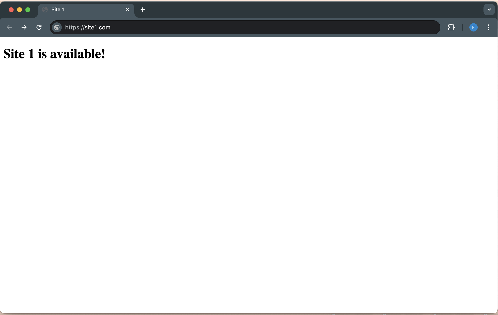

## Настроить nginx по заданному тз:
1. Должен работать по https c сертификатом
2. Настроить принудительное перенаправление HTTP-запросов (порт 80) на HTTPS (порт 443) для обеспечения безопасного соединения.
3. Использовать alias для создания псевдонимов путей к файлам или каталогам на сервере.
4. Настроить виртуальные хосты для обслуживания нескольких доменных имен на одном сервере.


Устанавливаем `nginx`

Для создание сертификата устанавливаем `openssl` и создаем сертификат. 

```sudo openssl req -x509 -nodes -days 365 -newkey rsa:2048 -keyout /etc/ssl/private/selfsigned.key -out /etc/ssl/certs/selfsigned.key```


Создаем папки
```sudo mkdir -p /etc/nginx/sites-available```
```sudo mkdir -p /etc/nginx/sites-enabled/```

Там создаем два файла `site1` и `site2`, в них прописываем перенаправление на нужный порт, а также только что созданный сертификат для https. Задаем корневые папки для каждого проекта

`site1`
```
server {
    listen 80;
    server_name site1.com;
    
    location / {
        root /var/www/site1;
        index index.html;
    }
    
    return 301 https://site1.com$request_uri;
}

server {
    listen 443 ssl;
    server_name site1.com;
    
    
    ssl_certificate /etc/ssl/certs/selfsigned.crt;
    ssl_certificate_key /etc/ssl/private/selfsigned.key; 
    
    location / {
        root /var/www/site1;
        index index.html;
    }
}
```

`site2`
```
server {
    listen 80;
    server_name site2.com;
    
    location / {
        root /var/www/site2;
        index index.html;
    }
    
    return 301 https://site2$request_uri;
}

server {
    listen 443 ssl;
    server_name site2.com www.site2.com;
    
    ssl_certificate /etc/ssl/certs/selfsigned.crt;
    ssl_certificate_key /etc/ssl/private/selfsigned.key; 
    
    location / {
        root /var/www/site2;
        index index.html;
    }
}
```

Также создаем файлы `index.html` в `/var/www/site2` и `/var/www/site1`

Добавляем в `/etc/hosts` доменные имена `site1` и `site2` чтобы их можно было открыть на сервере. 
```
127.0.0.1   site1.com www.site1.com
127.0.0.1   site2.com www.site2.com
```
Запускаем nginx


Проверяем в браузере, что все работает



Теперь добавим `alias` для site1

Создадим в `/var/www/site1` папку `second_page`, и добавим в нее новый html файл.
В файле `site1` создаём путь second_page, в котором будет находиться наша новая директория
`site1`
```
server {
    listen 80;
    server_name site1.com;
    
    location / {
        root /var/www/site1;
        index index.html;
    }
    
    return 301 https://site1.com$request_uri;
}

server {
    listen 443 ssl;
    server_name site1.com www.site1.com;
    
    ssl_certificate /etc/ssl/certs/selfsigned.crt;
    ssl_certificate_key /etc/ssl/private/selfsigned.key; 
    location / {
        root /var/www/site1;
        index index.html;
    }
    location /second_url/ {
        alias /var/www/site1/second_page/;
    }
}
```
Теперь, если перейти по `second_page/index.html` выведется второй html файл


