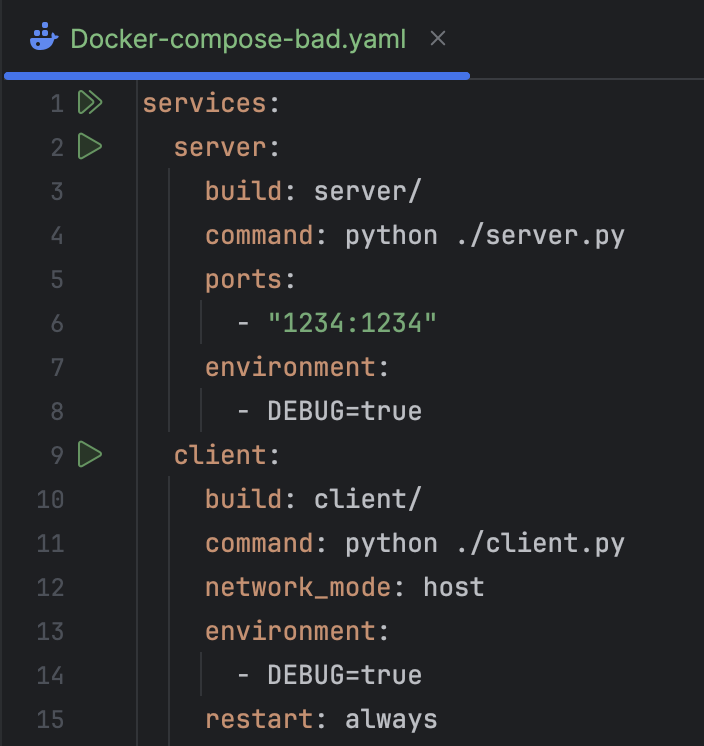
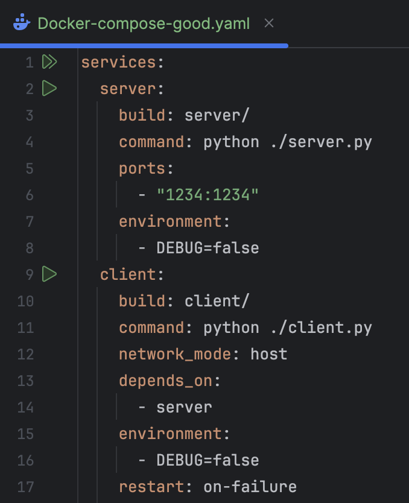

## Техническое задание
1. Написать “плохой” Docker compose файл, в котором есть не менее трех “bad practices” по их написанию
2. Написать “хороший” Docker compose файл, в котором эти плохие практики исправлены
3. В Readme описать каждую из плохих практик в плохом файле, почему она плохая и как в хорошем она была исправлена, как исправление повлияло на результат
4. После предыдущих пунктов в хорошем файле настроить сервисы так, чтобы контейнеры в рамках этого compose-проекта так же поднимались вместе, но не "видели" друг друга по сети. В отчете описать, как этого добились и кратко объяснить принцип такой изоляции

> "Плохой" Docker compose файл



> "Хороший" Docker compose файл



### Ошибка 1 - не использовать `depends_on` в зависимых частях
Допустим, что в приложении есть две части, клиент и сервер, клиент зависит от сервера, поэтому в `docker-compose.yaml` нужно это прописать. 
Если этого не написать, может возникнуть проблема, когда клиент попытается подключиться к серверу, когда он будет не до конца запущен, это может привести к ошибкам соединения. 
Вот как должно быть: 
```yaml
services:
  server:
    ...
  client:
    ...
    depends_on:
      - server
```
### Ошибка 2 - использовать `debug=true`
`debug=true` используется для тестирования или отладки, но после этого, когда все точно работает нужно поменять `true` на `false`. 
При `debug=true` приложение может выводить важные конфиденциальные. Так же в режиме отладки может быть больше логирования, что с одной стороны может привести к падению производительности, с другой стороны в логах будет много данных, и найти нужную информацию будет сложнее.

### Ошибка 3 - использование `restart:always`
`restart:always` будет перезапускать контейнер в любой ситуации, даже если вручную написать команду `docker stop`.  
Если контейнер постоянно завершается с ошибкой, Docker будет пытаться его перезапустить бесконечно и это может привести к перегрузке системы. 
Так же если контейнер сам будет перезапускаться постоянно, можно не заметить вовремя. 
Вместо `restart:always` можно использовать `restart:on-failure` - в этом случае контейнер перезапустится только в случае ошибки.

### Итог 
1) Теперь все зависимые части будут запущены только в том случае, если все необходимые части запустились. 
2) При отключенном режиме отладки меньше вероятность взломать приложение. 
3) Более быстрое обнаружение ошибок, тк контейнеры не будут перезапускаться очень много раз

> Для того, что бы контейнеры не видели друг друга по сети, настроим для каждого контейнера свсою сеть 
```yaml
networks:
  client_net:
    driver: bridge
  server_net:
    driver: bridge
``` 
> теперь нужно в каждом контейнере назначит сеть с помощью ```networks```(в каждом свою: client - client_net, server - server_net
> Таким образом, контейнеры будут подниматься вместе, но не будут находиться в одной сети и соответсвенно не будут друг друга видеть. 
> С помощью ```driver: bridge``` контейнеры смогут общаться только если находятся в одной сети. 
