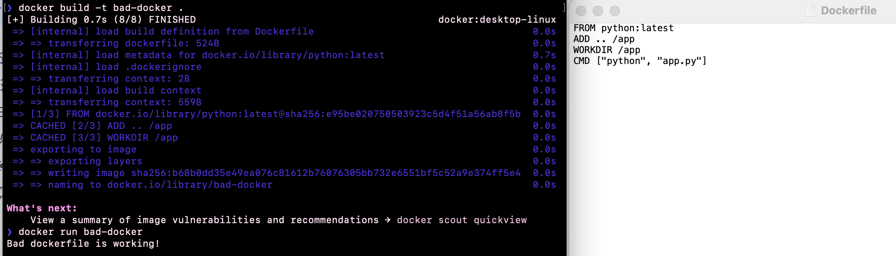
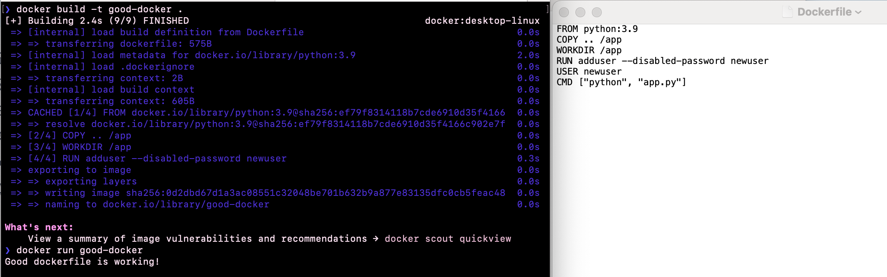

## Лабораторная работа 2

### Техническое задание
1. Написать “плохой” Dockerfile, в котором есть не менее трех “bad practices” по написанию докерфайлов
2. Написать “хороший” Dockerfile, в котором эти плохие практики исправлены 
3. В Readme описать каждую из плохих практик в плохом докерфайле, почему она плохая и как в хорошем она была исправлена, как исправление повлияло на результат
4. В Readme описать 2 плохих практики по работе с контейнерами. !Не по написанию докерфайлов, а о том, как даже используя хороший докерфайл можно накосячить именно в работе с контейнерами.

> Написать “плохой” Dockerfile, в котором есть не менее трех “bad practices”

```dockerfile
FROM python:latest
ADD .. /app
WORKDIR /app
CMD ["python", "app.py"]
```
> Сборка и запуск


> Написать “хороший” Dockerfile, в котором эти плохие практики исправлены
```dockerfile
FROM python:3.9
COPY .. /app
WORKDIR /app
RUN adduser --disabled-password newuser
USER newuser
CMD ["python", "app.py"]
```
> Сборка и запуск


> В Readme описать каждую из плохих практик в плохом докерфайле, почему она плохая и как в хорошем она была исправлена, как исправление повлияло на результат

### Ошибка 1 - указывать в базовом образе версию `latest`, вместо определенной.
Не правильно: `FROM python:latest`

Правильно: `FROM python:3.9`

При указании версии `latest` могут возникнуть ошибки(когда новая версия сильно отличается от предыдущих). При указании определенных версий сборка всегда будет одинаковой, поэтому таких ошибок не возникнет.

### Ошибка 2 - для копирования файлов использовать `ADD` вместо `COPY`
Не правильно: `ADD . /app`

Правильно: `COPY . /app`

`COPY` работает более предсказуемо - понятно, что он просто скопирует файлы. У `ADD` есть и другие возможности, например если будет архив, `ADD` его разархивирует(что может быть совершенно не нужным).

### Ошибка 3 - выполнять все от имени `root`
Не правильно: 

`CMD ["python", "app.py"]`

Правильно: 

```
RUN adduser --disabled-password newuser
USER newuser
CMD ["python", "app.py"]
```

При использовании `root` пользователя можно делать все, что захочется, а это не очень хорошо с точки зрения безопасности. Это особенно опасно в больших проектах, т.к. можно получить доступ к конфиденциальным данным. При создании нового пользователя с определенными правами, мы избегаем этой ошибки и оставляем наши данные в ценности и сохранности.:)

### Итог
Так, устранив выше описанные ошибки, Dockerfile стал более предсказуемый и стабильный, более безопасный.

> Плохие практики работы с контейнерами

### Плохая практика 1 - хранить данные только в контейнере
При удалении(или пересборке) контейнера данные могут потеряться, если они не были сохранены в другом месте. 
Даже если помнить о том, что данные хранятся только в одном контейнере, и например при удалении этого контейнера данные забрать будет сложнее, чем изначально их хранить в другом месте(например в `Docker Volumes`)

Так же могут возникнуть сложности при тестировании приложения - если каждый раз пересобирать контейнер и пересохранять данные, скорость тестирования значительно уменьшится.

### Плохая практика 2 - не ограничивать ресурсы
Более актуально для тяжелых приложений. 
Если не ограничивать ресурсы, контейнер может потреблять слишком много ресурсов, что приведет к снижению общей производительности или производительности других контейнеров.
