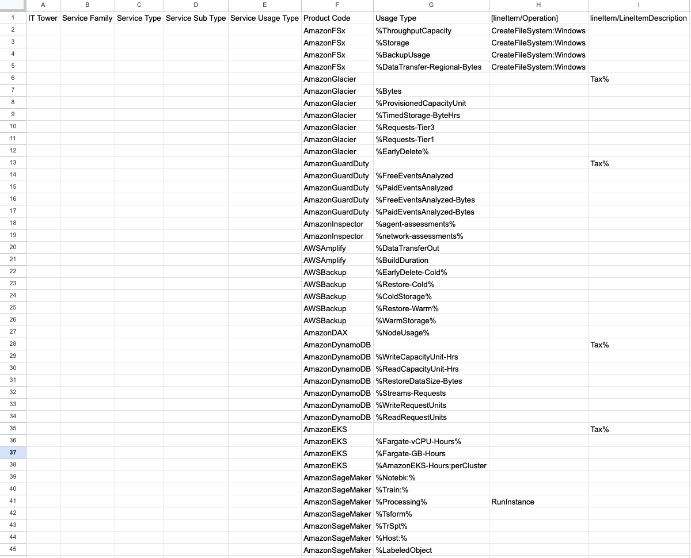
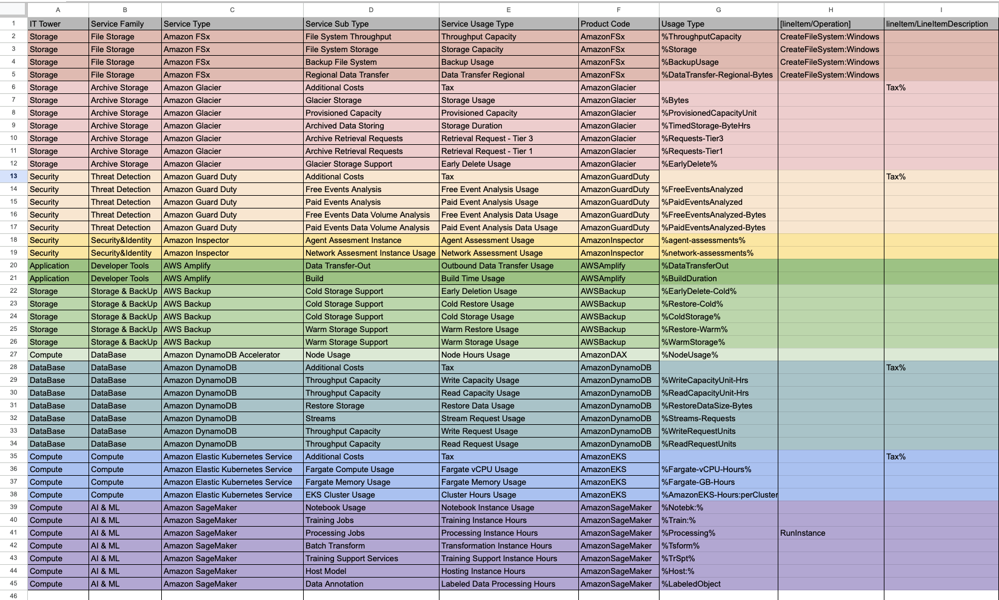

## Лабораторная работа 1. Знакомство с IaaS, PaaS, SaaS сервисами в облаке на примере Amazon Web Services (AWS). Создание сервисной модели.

### Вариант 8

### Выполнение работы 
#### Исходные данные

#### Классифицируем сервисы по их типам и подтипам. 

1. IT Tower
Команда, которая занимается поддержкой функционала и настройкой сервисов. 
Например: вычисления и хранение данных, обеспечение безопасности, аналитика данных.
2. Service Family
Группа сервисов с похожими задачами, которые связанны с определенными приложениями. 
Например: кэширование, безопасность, работа с файлами.
3. Service Type
Конкретная категория сервиса внутри группы(название сервиса AWS). 
Например: AmazonGlacier, AmazonFSx, GuardDuty.
4. Service Sub Type
Узкий подтип сервиса, который нужен для выполнения одной задачи. 
Например: безопасность, ускорение. 
5. Service Usage Type
Описание, как используется сервис (модель потребления).
Примеры: временное хранилище, объём данных, который может быть обработан.

В колонке `ProductCode` имеются следующие описание облачных сервисов AWS: 

AmazonFSx, AmazonGlacier, AmazonGuardDuty, AmazonInspector, AWSAmplify, AmazonDAX, AmazonDynamoDB, AmazonEKS, AmazonSageMaker
### Описание облачных сервисов AWS

1. Amazon FSx
    Обеспечивает полностью управляемое общее хранилище, построенное на базе Windows Server, и предоставляет широкий спектр возможностей для доступа к данным, управления ими и администрирования.

2. Amazon Glacier
   Сервис предназначен для долговременного хранения данных. Подходит для архивов с различными типами данных. 

3. Amazon GuardDuty
   Сервис для обнаружения угроз. Защищает учетные записи AWS, для этого анализируется активность и наличие других угроз.

4. Amazon Inspector
   Сервис для автоматизированной аналитики безопасности, выявления уязвимостей и анализа конфигурации ресурсов AWS. Cравнивает настройки с рекомендованными и помогает обеспечить соответствие требованиям безопасности.

5. AWS Amplify
   Сервис для разработки веб и мобильных приложений с облачной инфраструктурой, включая инструменты для интеграции с другими сервисами.

6. Amazon DAX
   Сервис для кэширования данных в памяти. Повышает производительность приложений, работающих с сервисом Amazon DynamoDB. 
   Минимизирует задержки для операций чтения данных.

7. Amazon DynamoDB
   Сервис для работы с NoSQL с большим объемом данных. Предоставляет автоматическое масштабирование и низкую задержку.

8. Amazon EKS
   Amazon Elastic Kubernetes Service - сервис для развертывания и управления контейнерами Kubernetes в AWS, упрощается работа с Kubernetes.

9. Amazon SageMaker
   Это сервис для построения, обучения и развертывания моделей машинного обучения. Есть функции подготовки данных, обучения ML-моделей, управления ими.

#### Результат заполнения таблицы

[Ссылка на таблицу](https://docs.google.com/spreadsheets/d/1DIIecRu0tqX-boeYQp2cg-ypSuZ9sG8sRKHS7iC2hSc/edit?usp=sharing)
#### Вывод
В ходе лабораторной работы были исследованы и описаны 10 сервисов, включая их подтипы и характеристики. 