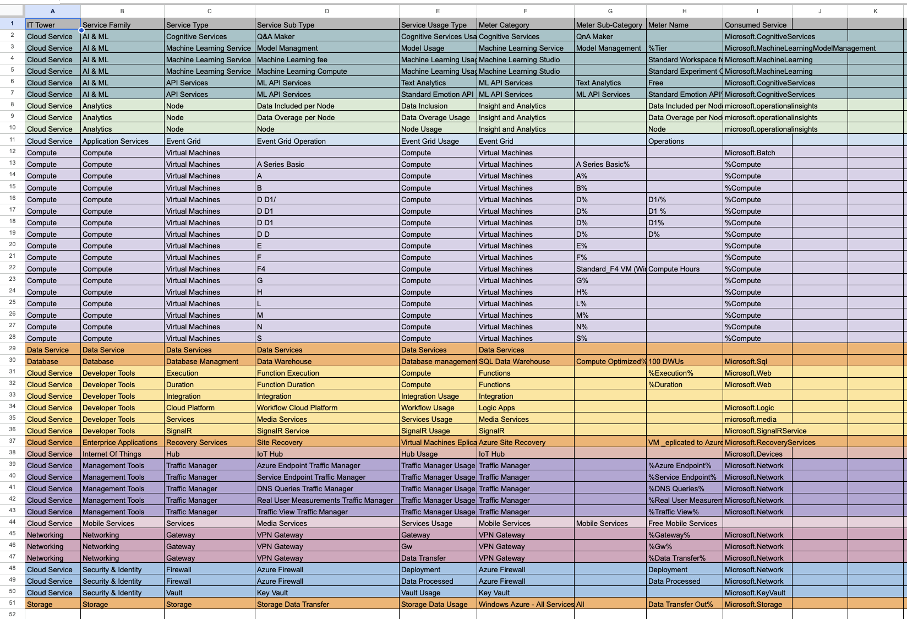

### Лабораторная работа 2
## Вариант 3
#### Цель работы
Получение навыков аналитики и понимания спектра публичных облачных сервисов без привязки к вендору. Формирование у студентов комплексного видения Облака. 
### Выполнение работы 
#### Исходные данные

#### Описание сервисов 
1. **Azure Cognitive Services**
    Это набор API, SDK и сервисов, позволяющий создавать приложения с использованием интеллектуальных алгоритмов и машинного обучения.
2. **Azure Machine Learning Service**
   Эта облачная служба предназначена для ускорения и упрощения жизненного цикла проектов с ML, для их эффективного управления. Она помогает интегрировать обучение, развертывание моделей и управление операциями машинного обучения в рабочие процессы.
3. **Azure Machine Learning Studio**
   Платформа для разработки и тестирования моделей машинного обучения, не требующая написания кода.
4. **Azure ML API Services** 
   API для интеграции функций машинного обучения в приложения.
5. **Azure Event Grid**
    Это масштабируемая, полностью управляемая служба распространения сообщений Pub Sub, которая предлагает гибкие схемы использования сообщений с использованием протоколов MQTT и HTTP.
6. **Azure Virtual Machines**
    Сервис, позволяющий создавать и запускать виртуальные машины в облаке, предоставляя возможность размещать приложения и системы на базe операционных систем Windows и Linux.
7. **Azure Data Services**
    Набор облачных сервисов от Microsoft, предназначенных для хранения, обработки, анализа и управления данными. 
8. **Azure SQL Data Warehouse**
    Cервис, предназначенный для хранения и обработки больших объемов данных. Он позволяет интегрировать данные из различных источников, а также использовать мощные возможности для аналитики и обработки в реальном времени. 
9. **Azure Functions**
   Безсерверный вычислительный сервис, который позволяет выполнять код в ответ на события, без необходимости управлять инфраструктурой.
10. **Azure Integration**
    Это набор сервисов и инструментов в облаке Azure, предназначенных для интеграции различных приложений и данных, объединяет и автоматизирует процессы между облачными и локальными сервисами.
11. **Azure Logic Apps**
    Облачная платформа, на которой можно создавать и запускать автоматизированные рабочие процессы практически без использования кода.
12. **Azure Media Services**
    Облачный сервис для обработки, хранения и потоковой передачи видео и аудио. Он предоставляет инструменты для кодирования, транскодирования, защиты контента и доставки медиафайлов с высокой доступностью.
13. **SignalR**
    Это библиотека для ASP.NET, которая упрощает добавление веб-функций в реальном времени в приложения. 
14. **Azure Site Recovery**
    Служба обеспечивает непрерывность работы приложения, поддерживая его функционирование в случае сбоев. Azure Site Recovery реплицирует рабочие нагрузки, выполняющиеся на физических и виртуальных машинах, с основного сайта на резервный.
15. **Azure IoT Hub**
    Облачный сервис для подключения, мониторинга и управления IoT-устройствами. Он обеспечивает двустороннюю связь между устройствами и облаком, поддерживает безопасность, масштабируемость и интеграцию с другими сервисами Azure.
16. **Azure Traffic Manager**
     Это балансировщик трафика на основе DNS, позволяет распределять трафик между приложениями в глобальных регионах Azure, обеспечивает высокую доступность.
17. **Mobile Services**
    Облачный сервис, предназначенный для создания функциональных мобильных приложений для популярных мобильных платформ: Windows 8, Windows Phone, iOS и Android.
18. **Azure VPN Gateway**
     Это сервис, который используется для передачи зашифрованного трафика между виртуальной сетью Azure и локальной сетью.
19. **Azure Firewall**
    Брандмауэр облачных сервисов с возможностью масштабирования, анализом внешних и внутренних соединений со встроенными инструментами защиты. 
20. **Azure Key Vault**
    Облачный сервис для безопасного хранения секретов и доступа к ним. Хранить можно API-ключи, пароли, сертификаты или криптографические ключи.

### Результат заполнения таблицы

[Ссылка на таблицу](https://docs.google.com/spreadsheets/d/1aBO0rESEwW069DsAslqNMlt-KJlkSYC_/edit?usp=sharing&ouid=118056554976553961614&rtpof=true&sd=true)
